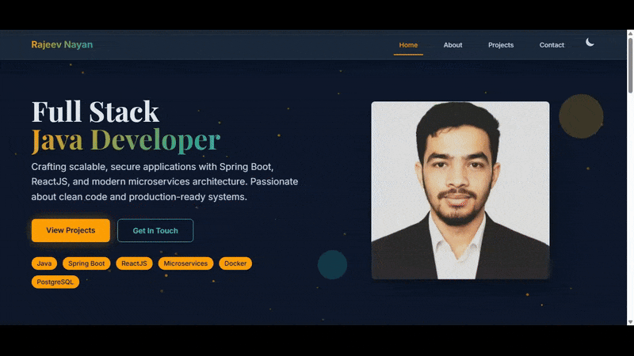

# Portfolio Website ✨

This is my personal **Portfolio Website** designed to showcase my skills, projects, and experience. It serves as a professional online presence for potential employers, collaborators, and anyone interested in my work. The website features a modern design, a responsive layout, and interactive elements for a great user experience.

## 🚀 Live Demo

Check out the live version of the website here:
[Live Demo of the Portfolio Website](https://imrajeevnayan.github.io/Portfolio/)

## 📸 Portfolio Demo




## 🔧 Features

- **Responsive Design**: The website adapts seamlessly across all devices, from mobile phones to desktop computers.
- **Dark/Light Theme**: Switch between dark and light mode for better readability and personalized experience.
- **Project Showcase**: Display a selection of my projects, including descriptions, technologies used, and links to live demos and source code.
- **About Me**: A dedicated section to introduce myself, my background, and my skills.
- **Contact Form**: A functional contact form to allow visitors to easily reach out.
- **Resume Download**: A direct link to download my resume in PDF format.

## ⚙️ Technologies Used

- **HTML5**: For structuring the website’s content.
- **CSS3**: For styling the website, implementing responsive design and the dark/light theme toggle.
- **JavaScript**: For interactive elements like the theme switcher and form validation.
- **GitHub Pages**: Used for hosting the live version of the portfolio.

## 🏁 Getting Started

### Prerequisites

You only need a web browser to view the website.

### Installation

To run the website locally, follow these steps:

1. Clone the repository:

    ```bash
    git clone https://github.com/imrajeevnayan/Portfolio.git
    ```

2. Navigate to the project directory:

    ```bash
    cd Portfolio-Website
    ```

3. Open `index.html` in your preferred web browser to view the site.

## 🗂️ Project Structure

````

.
├── about.html           # Page with information about me
├── contact.html         # Page with the contact form
├── design.md            # Design documentation
├── index.html           # Main landing page
├── interaction.md       # Interaction/Behavior documentation
├── main.js              # JavaScript for interactive functionality
├── outline.md           # Outline of the website structure
├── projects.html        # Page displaying my projects
├── README.md            # This file
├── style.css            # Main CSS stylesheet
└── resources/           # Folder for images, resume, etc.
├── hero-image.png   # Hero image (used in the landing page)
├── professional-photo.jpg # Professional photo
└── resume.pdf       # Downloadable resume

````

### Key Files

- `index.html`: The homepage of the portfolio.
- `about.html`: A page that introduces me and my skills.
- `projects.html`: A page showcasing my projects, each with a description, technologies used, and links.
- `contact.html`: A page with a form for contacting me.
- `style.css`: The main stylesheet that handles layout, color scheme, and responsiveness.
- `main.js`: Contains JavaScript for features like the dark/light theme toggle and form validation.
- `resources/`: Contains images (e.g., `hero-image.png`, `professional-photo.jpg`) and my resume (`resume.pdf`).

## 🤝 Contributing

Contributions are what make the open-source community a great place to learn, share, and grow. If you have any suggestions or want to contribute to the project, feel free to fork the repository and create a pull request.

### How to Contribute

1. Fork the repository
2. Create a new feature branch:

    ```bash
    git checkout -b feature/YourFeature
    ```

3. Commit your changes:

    ```bash
    git commit -m 'Add some amazing feature'
    ```

4. Push to your branch:

    ```bash
    git push origin feature/YourFeature
    ```

5. Open a pull request.

If you're unsure, feel free to open an issue with the tag "enhancement".

## 📄 License

This project is distributed under the MIT License. See the [LICENSE](LICENSE) file for more details.

## 💬 Contact Me

- 📧 **Email**: [imrajeevnayan@gmail.com](mailto:imrajeevnayan@gmail.com)
- 🔗 **LinkedIn**: [linkedin](https://www.linkedin.com/in/imrajeevnayan/)
- 📸 **Instagram**: [Instagram](https://www.instagram.com/imrajeevnayan/)

---

<p align="center">
  Made with ❤️ by <strong>Rajeev Nayan</strong>
</p>
<p align="center">
  <a href="https://github.com/imrajeevnayan/Portfolio">
    
  </a>
</p>
   <h1 align="center">
## 🏆 Thank you for visiting my portfolio website! 😊
</h1>
